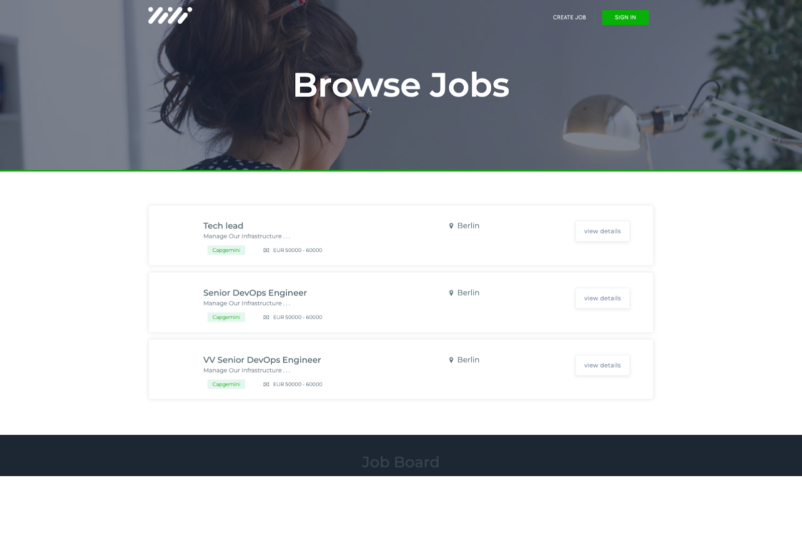
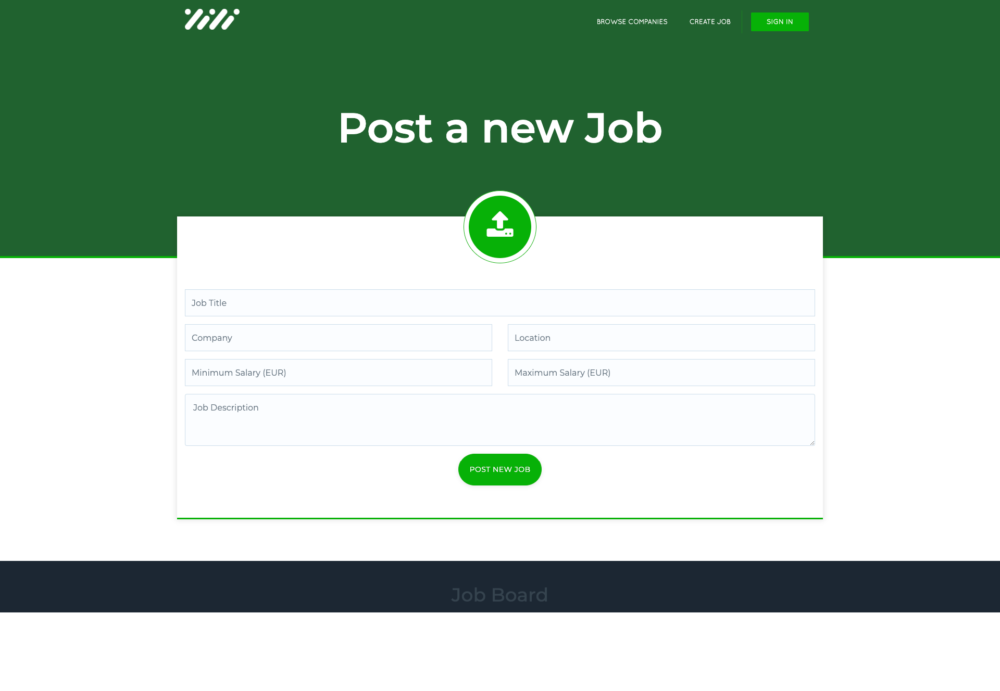
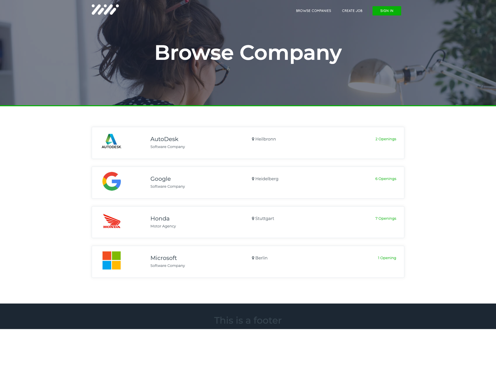
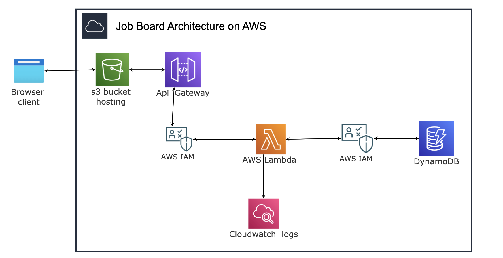
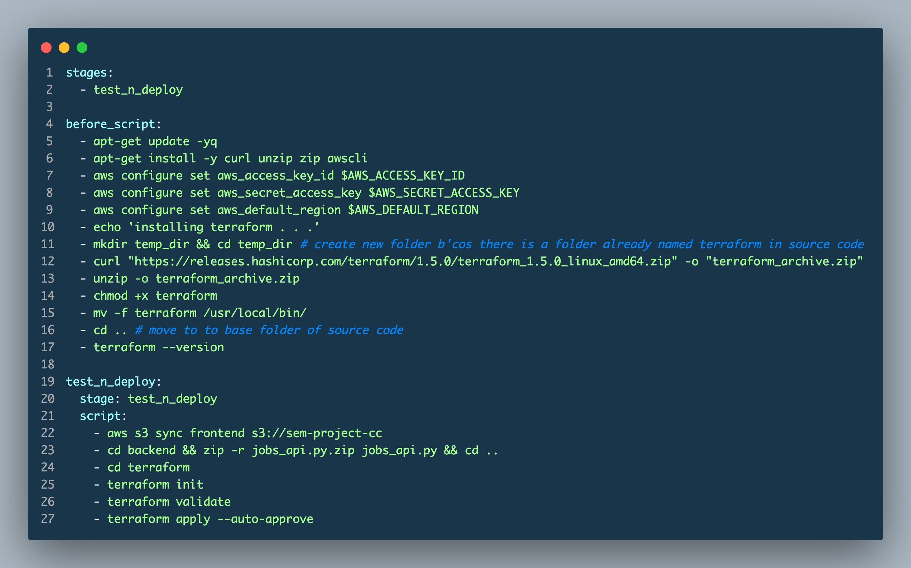

 

# Project Documentation - Job Listing Platform

###### Prof. Dr Thomas Fankhauser | Cloud Computing | Orange Repo | Hochshule Heilbronn 

---

 
<table>
    <tbody>
        <tr>
            <td>Students (ID)</td>
            <td>Sylvester Baidoo-Antwi - SEM 217465</td>
        </tr>
        <tr>
            <td>Semester</td>
            <td>Summer Semester 2023</td>
        </tr>
        <tr>
            <td>Repository</td>
            <td><a href="https://git.it.hs-heilbronn.de/it/courses/msem/cc2/ss23/orange">https://git.it.hs-heilbronn.de/it/courses/msem/cc2/ss23/orange</a>&nbsp;</td>
        </tr>
        <tr>
            <td>Course</td>
            <td>Cloud Computing SS23 (SEM)</td>
        </tr>
        <tr>
            <td>Course ID</td>
            <td>172369</td>
        </tr>
    </tbody>
</table>

## Chapter 1 - Introduction

The project involves the development of a simplified job board, which serves as a centralized platform connecting job seekers with employers. It provides a platform for recruiters, companies and employers to post their available vacancies. Job seekers browse the list and apply to the ones that match their skills and location by following the instructions given in the description of the job. The application consists of two main functionalities: a job listing page and a create new job page.

To provide a user-friendly interface, the frontend of the application was developed as a static website using HTML and JavaScript. The frontend interacts with the backend through API endpoints to fetch a list of available jobs and to create new job listings.

The backend of the application is built as a serverless application using AWS Lambda and Python. The backend exposes Representational State Transfer (REST) API endpoints that handle requests from the frontend. The data is stored in DynamoDB, a cloud database service provided by AWS. The use of serverless architecture allows for automatic scaling based on demand, ensuring efficient resource allocation.

### 1.1 screenshots of the application:
Here are some screenshots of the frontend of the application which is available at 
[http://sem-project-cc.s3-website.eu-central-1.amazonaws.com/](http://sem-project-cc.s3-website.eu-central-1.amazonaws.com)

Figure 1.1.1 - Job Listings 

Figure 1.1.2 - Create a job 

Figure 1.1.3 - Job Details Page

## Chapter 2 - Architecture 

The architecture of the application was designed to leverage the benefits of various AWS services. The static website is hosted in a public AWS S3 bucket. The use of AWS Lambda for the backend allows for event-driven, serverless computing, eliminating the need for managing server infrastructure. The data is stored using DynamoDB, a cloud-based NoSQL database service provided by AWS. DynamoDB was chosen as the database service for its scalability and high-performance capabilities.  Figure 2.1 shows a visual representation of the architecture of the application.

Figure 2.1 - Architecture of job board project

### 2.1 Inter-component Communication

The communication between components is event-driven. For example, an incoming  HTTP request is received at the API Gateway. The API gateway triggers the Lambda function handler, which is a python code. The lambda (python code) interacts with the DynamoDB to read from the database or write data to the database. The Identity and Authorization Management policy that was created grants the lambda permissions to interact with the database - DynamoDB. Any log data or error is written to the application logs which is viewable on cloudwatch.

### 2.2 Scalability

The application scales out automatically as AWS Lambda and DynamoDB automatically scale out by creating additional instances in response to increased demand. When the number of incoming requests, Lambda provisions more instances of the function to handle the workload concurrently.

### 2.3 Data Model

The data model of the application includes entities such ‘jobs’. The data model is stored in DynamoDB and follows a NoSQL structure. The attributes of the job entity is shown in Table 2.1

**Table 2.1 - Data model for the job entity**

<table>
    <tbody>
        <tr>
            <td><strong>Attribute</strong></td>
            <td><strong>Data Type</strong></td>
        </tr>
        <tr>
            <td>title</td>
            <td>string</td>
        </tr>
        <tr>
            <td>description</td>
            <td>string</td>
        </tr>
        <tr>
            <td>company</td>
            <td>string</td>
        </tr>
        <tr>
            <td>location</td>
            <td>string</td>
        </tr>
        <tr>
            <td>salary_min</td>
            <td>integer</td>
        </tr>
        <tr>
            <td>salary_max</td>
            <td>integer</td>
        </tr>
        <tr>
            <td>createdAt</td>
            <td>string</td>
        </tr>
    </tbody>
</table>

### 2.4 AWS - Services Used

The application uses the following AWS services:

1. **AWS Lambda:** For executing the backend python code responsible for handling REST API requests. It reads and writes data to the database. Lambda was selected because its serverless - scales automatically and server management is not involved.
2. **DynamoDB**: A NoSql database, was used in storing and retrieving  data about jobs posted by employers and recruiters. DynamoDB was used because it provides fast and predictable performance with seamless scalability. It is a managed NoSQL database which fits well with our serverless architecture.
3. **API Gateway**: For exposing the API endpoints, shown in table 2.2, to interact with the lambda backend.
4. **Identity and Authorisation Management** **(IAM)**: For managing access control and permissions for DyanmoDB.
5. **Simple Storage Service** (s3): S3, a serverless storage solution was used to host static website files. This was chosen for hosting because s3 buckets provide a highly cost-effective solution for hosting static websites. Only the storage and data transfer has to be paid for, and that is typically much lower compared to traditional web hosting services.

**2.5 Application Programming Interface (API)**

The application exposes REST API endpoints to enable communication between the frontend and the backend. These endpoints handle requests for fetching job listings and creating new job listings. The communication between the frontend and the backend occurs over HTTP protocols.

The communication between the frontend and backend is facilitated by the API Gateway, which acts as a mediator for the requests and responses.

 Table 2.2 - Api endpoints exposed by api gateway

<table>
    <tbody>
        <tr>
            <td>Description</td>
            <td>HTTP Method</td>
            <td>Relative URL</td>
            <td>Request</td>
            <td>Sample Response</td>
        </tr>
        <tr>
            <td>Create a new Job</td>
            <td>POST</td>
            <td>/jobs</td>
            <td>&nbsp;</td>
            <td>&nbsp;</td>
        </tr>
        <tr>
            <td>Retrieve a list of jobs</td>
            <td>GET</td>
            <td>/jobs</td>
            <td></td>
            <td>&nbsp;</td>
        </tr>
        <tr>
            <td>&nbsp;</td>
            <td>GET</td>
            <td>/jobs/:id</td>
            <td>&nbsp;</td>
            <td>&nbsp;</td>
        </tr>
    </tbody>
</table>

The base url is : [https://3w4vxzdpzj.execute-api.us-east-2.amazonaws.com/prod/](https://3w4vxzdpzj.execute-api.us-east-2.amazonaws.com/prod/) 

## Chapter 3 -  Tooling
### 3.1 Working on the application

The development process of the application is facilitated by several tools and practices. The application was worked on in a local development environment in Visual Studio Code, a text editor. The following tools were installed in the local environment to enable testing parts of the application locally - 

-  **Command Line Interface for Amazon Web Services** (aws-cli) : for interacting with resources in the AWS account. An IAM user was created in the AWS portal and the access key id, secret access key and default aws region were stored in a file on disk located at  ~./aws/credentials
-  **Git** : a version control system was used to save code changes, fetch code from the remote repository and also send code (push) to the remote repository.

-  **Python programming language** : was used in implementing the REST api endpoints outlined in Table 2.2 .
### 3.2 Automation
-  **Terraform** : an Infrastructure as Code tool, was used for automated infrastructure provisioning and management, ensuring consistent and reproducible deployments. It was used to define the AWS resources required for the application, such as API Gateway, Lambda functions, DynamoDB, and IAM policies.
- **CI/CD**: When code changes are deployed, GitLab CI/CD automatically applies the Terraform configuration, which creates, updates, or deletes the necessary AWS resources.

### 3.3 Deployment Process
Code changes in the serverless job listing platform are deployed using GitLab's CI/CD pipelines. The deployment process involves the following steps:

1. **Version Control and Collaboration**: Developers work in feature branches in the Git repository and collaborate using GitLab's version control system. Branches are created for each new feature or bug fix.

2. **Continuous Integration/Continuous Deployment (CI/CD)**: The CI/CD pipeline is triggered automatically when changes are pushed to the repository. It performs automated builds, tests, and deployments.

3. **Test and Deploy**: During the pipeline, the code changes are built, tested, and packaged for deployment. 

### 3.3 Deploying Code Changes to AWS Resources
To deploy code changes to the AWS resources;

1. **Push Changes**: Push code changes to the Git repository's feature branch.

2. **GitLab CI/CD**: GitLab's CI/CD pipelines will automatically be triggered by the code changes. The pipeline stages will execute sequentially.

3. **Monitor Pipeline**: Monitor the pipeline's progress and check for any failures or errors. The pipeline's status and logs can be accessed from the GitLab project's CI/CD interface.

4. **Verify Deployment**: After a successful pipeline run, verify that the code changes are deployed correctly by testing the functionality on the deployed application.

The pipeline is defined in the CI/CD configuration file named ‘**.gitlab-ci.yml**’. Whenever a commit is pushed to any branch of the GitLab repository, the pipeline is triggered. It specifies the sequence of tasks to be executed including installing terraform, aws-cli in the test environment, validating the terraform configuration (**/terraform/main.tf**) and automatically deploying the application to AWS using Terraform. The pipeline terminates immediately when any error occurs. 

The pipeline file looks like this : 

Figure 3.1 

## Chapter 4 - Lessons Learned
### 4.1 - Learnings

- First of all, the automation of infrastructure using Terraform is an invaluable tool. It enabled consistent and repeatable deployments and simplified the management of AWS resources using code.

- Another lesson learnt is, the CI/CD pipeline helps streamline the development and deployment process. The pipeline can be used to automate many tasks, such as performing automated tests, ensuring code quality, deploying code to production.

- Monitoring and logging were essential for troubleshooting and identifying issues. Sometimes the value of a variable needs to be logged as part of the debugging process. Integrating with AWS CloudWatch for monitoring and logging provided valuable insights into the application's performance.

- Last but not least, serverless computing enables developers to build applications faster because they don't have to worry about managing their own servers or handling scaling. Cloud resources need to be configured correctly according to the project's needs to avoid over-billing. 

### 4.2 - Easy and Complicated
#### 4.2.1 - Easy
- **Scalability**: One of the easy aspects was to not worry about increase traffic because AWS Lambda and DynamoDB will handle it.

#### 4.2.2 Complicated
- **Understanding the overall structure of the application and flow of the development was a very steep learning curve**, especially for us who are not well vexed Serverless Architecture -*Cloud* and IaCs - *Terraform*.
- **Working with a non-collaborative team member** can present challenges in terms of communication, cooperation, and alignment on project goals and standards. This can result in delays, misunderstandings, and a lack of cohesion within the team.

## Chapter 5 - Conclusion

Overall, the project provided valuable insights into building scalable and serverless applications using AWS services. 
It emphasized the importance of automation, proper infrastructure design, and efficient communication between components. 
I have a new skill that set's me apart from fellow Job Applicants.

# Project Video
<video src="Video/Job_Board_vid.mp4" controls title="Project Video"></video>